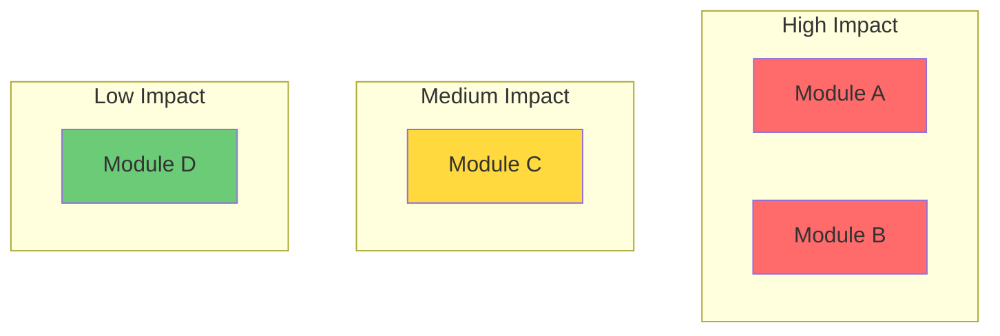
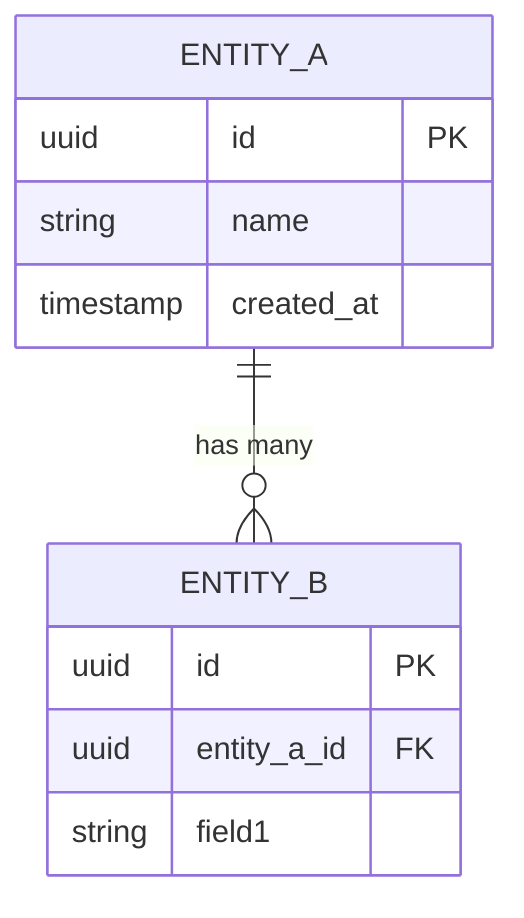
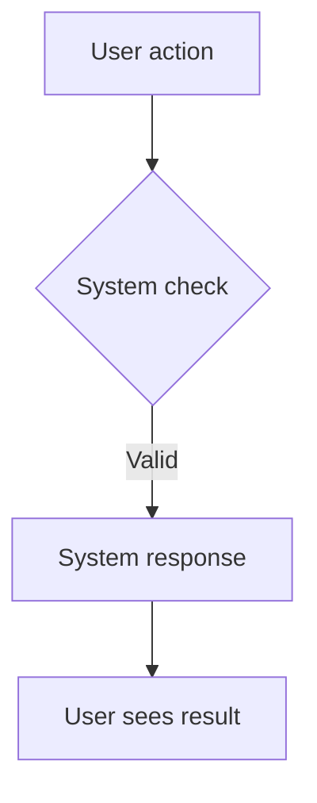
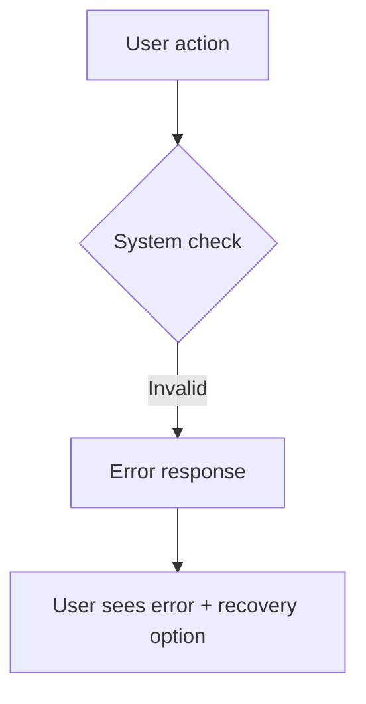

# BRD Field Reference — All Four Levels

Complete field definitions for the PM Agent's four-level hierarchy. Each field includes its description and the agent rule for generating it.

---

## Level 1 — BRD (Business Requirements Document)

Purpose: Answers "WHY are we doing this?" — strategic anchor.

| Field | Description | Agent Rule |
|-------|-------------|------------|
| BRD-ID | Unique identifier | Auto-generate (e.g., `BRD-2026-001`) |
| Title | Concise initiative name | Max 10 words |
| Business Problem | What pain exists, who feels it, cost of inaction | 1-3 sentences, must include quantifiable impact if possible |
| Business Objective | Measurable outcome | Must contain a number and a timeframe |
| Success Metrics | 2-4 KPIs with targets | Each: metric name, current baseline, target value, measurement method |
| Target Users | Who benefits | Include role/persona AND their primary context |
| Scope Boundary | IN scope + OUT of scope | Both lists mandatory — OUT is as important as IN |
| Constraints | Hard limits | Regulatory, technical, budget, timeline — only real constraints, not preferences |
| Assumptions | Beliefs that, if wrong, change the plan | Must be falsifiable |
| Dependencies | External blockers | Systems, teams, approvals, vendors |
| Linked Epics | List of Epic-IDs | Forward reference — fill after generating Epics |

### BRD Extended Fields

| Field | Description | Agent Rule |
|-------|-------------|------------|
| Product Heatmap | Visual map of functional areas impacted by this BRD | Mermaid.js diagram showing modules/services/screens affected. Color-code by impact: high/medium/low. |
| Telemetry & Analytics Plan | Specific tracking events engineers must implement | Per event: `Event: event_name \| Properties: prop1, prop2 \| Trigger: when_fired \| Tool: Mixpanel/GA/etc.` |
| Data Model (Conceptual) | Entities, relationships, data dictionary | Mermaid.js ER diagram + data dictionary table: entity, field, type, description, constraints |
| User Flow Diagrams | Visual user journeys through the feature | Mermaid.js flowcharts. Minimum: 1 happy path + 1 error path per core workflow. |
| NFRs (Classified) | Non-Functional Requirements by category | Categories: Performance, Scalability, Security/Compliance, Data Governance. Each NFR must have a testable threshold. |
| Release Strategy | How the feature launches | Define: rollout method (feature flags, canary %, A/B test), rollback criteria, success criteria for full rollout, monitoring plan during rollout. |

### BRD Markdown Template

```markdown
<brd id="BRD-XXXX">

# BRD: [Title — max 10 words]

**BRD-ID:** BRD-XXXX
**Status:** Draft | Approved | In Progress | Verified | Done
**Date:** YYYY-MM-DD
**Last Updated:** YYYY-MM-DD

## Business Problem
[1-3 sentences. Who feels the pain? Cost of inaction? Quantifiable impact.]

## Business Objective
[Measurable outcome with a number and a timeframe.]

## Success Metrics

| Metric | Current Baseline | Target | Measurement Method |
|--------|-----------------|--------|-------------------|
| [KPI 1] | [current] | [target] | [how measured] |
| [KPI 2] | [current] | [target] | [how measured] |

## Target Users
- **[Persona 1]:** [role] — [primary context/goal]
- **[Persona 2]:** [role] — [primary context/goal]

## Scope Boundary

### IN Scope
- [item 1]
- [item 2]

### OUT of Scope
- [item 1]
- [item 2]

## Constraints
- [Regulatory/Technical/Budget/Timeline constraint]

## Assumptions
- [Falsifiable assumption 1]
- [Falsifiable assumption 2]

## Dependencies
- [External system/team/approval/vendor]

## Product Heatmap



## Telemetry & Analytics Plan

| Event | Properties | Trigger | Tool |
|-------|-----------|---------|------|
| `event_name` | prop1, prop2 | [when fired] | [Mixpanel/GA/etc.] |

## Data Model (Conceptual)



**Data Dictionary:**

| Entity | Field | Type | Description | Constraints |
|--------|-------|------|-------------|-------------|
| EntityA | id | UUID | Primary key | auto-generated |
| EntityA | name | string | Display name | max 255 chars, required |

## User Flow Diagrams

### Happy Path — [Core Workflow Name]



### Error Path — [Core Workflow Name]



## Non-Functional Requirements

### Performance
- [NFR with testable threshold, e.g., "API response < 200ms at p95"]

### Scalability
- [NFR with testable threshold]

### Security / Compliance
- [NFR with testable threshold]

### Data Governance
- [NFR with testable threshold]

## Release Strategy
- **Rollout method:** [Feature flags / Canary X% / A/B test]
- **Rollback criteria:** [Specific conditions that trigger rollback]
- **Success criteria for full rollout:** [Metrics that must be met]
- **Monitoring plan:** [What to watch during rollout period]

## Linked Epics
- EPIC-001: [Title]
- EPIC-002: [Title]

## Existing Constraints (Brownfield only)
- [Legacy business rules that must be preserved]

## Integration Points (Brownfield only)
- [Where new feature connects to existing code]

## Risk Areas (Brownfield only)
- [Modules from risk register affected by this change]

## Open Questions
- [Unresolved decisions — each with a TBD deadline]

## Research Notes
- [Competitor analysis, technical findings, domain context]

</brd>
```

---

## Level 2 — Epic

Purpose: Answers "WHAT large capability do we build?"

| Field | Description | Agent Rule |
|-------|-------------|------------|
| Epic-ID | Unique identifier | Auto-generate, sequential. Prefix `[ENABLER]` for technical enabler epics. |
| Title | Capability name | Must describe a deliverable, not an activity |
| Parent BRD | BRD-ID reference | Always link back |
| Objective | What it delivers + how it moves BRD KPIs | Must reference a specific BRD success metric |
| User Impact Statement | "After this ships, [persona] can [outcome]" | Exactly this format. For `[ENABLER]`: "After this ships, [dev team] can [technical capability]" |
| Technical Context | Stack, architecture, patterns, key libraries | Be specific: "React 18 + Next.js 14 + PostgreSQL" not "modern frontend" |
| Data Model | Entities, relationships, key fields | Pseudo-schema notation or table format |
| API Contracts | Endpoints, methods, request/response shapes | Only if applicable — omit for pure frontend epics |
| Non-Functional Requirements | Performance, security, accessibility, browser support | Each NFR must have a testable threshold |
| Feature List | Ordered list of Feature-IDs | Brief 1-line description per feature |
| Sequencing | Build order + dependency graph | Notation: `FEAT-002 → FEAT-003 (blocked by)`. `[ENABLER]` epics always first. |
| Done Criteria | Epic-level acceptance test | 3-5 conditions that must all be true |

### Epic Markdown Template

```markdown
<epic id="EPIC-XXX" parent="BRD-XXXX" type="ENABLER|FUNCTIONAL">

# Epic: [Title — deliverable, not activity]

**Epic-ID:** EPIC-XXX [ENABLER]
**Parent BRD:** BRD-XXXX
**Type:** ENABLER | FUNCTIONAL

## Objective
[What it delivers. Must reference a specific BRD success metric.]

## User Impact Statement
After this ships, [persona] can [outcome].

## Technical Context
[Specific stack: "React 18 + Next.js 14 + PostgreSQL + Redis"]

## Data Model
[Pseudo-schema or table format]

## API Contracts
[Endpoints, methods, request/response — if applicable]

## Non-Functional Requirements
- [Each with testable threshold]

## Feature List
1. FEAT-001: [1-line description]
2. FEAT-002: [1-line description]

## Sequencing
- FEAT-001 (no dependencies)
- FEAT-002 → FEAT-001 (blocked by)

## Done Criteria
- [ ] [Condition 1]
- [ ] [Condition 2]
- [ ] [Condition 3]

</epic>
```

---

## Level 3 — Feature

Purpose: Answers "WHAT specific functionality does this contain?"

| Field | Description | Agent Rule |
|-------|-------------|------------|
| Feature-ID | Unique identifier | Auto-generate |
| Title | Specific capability | Must start with a verb or noun, never "The" |
| Parent Epic | Epic-ID reference | Always link back |
| Description | What + why it matters | 2-4 sentences |
| User Workflow | Happy path step-by-step | Numbered: "1. User does X → 2. System responds Y → 3. User sees Z" |
| Business Rules | Invariants the code must enforce | Numbered list — these become validation logic |
| UI/UX Requirements | Layout, components, states, responsive behavior | Reference specific components/patterns if design system exists |
| Acceptance Criteria | Testable pass/fail conditions | Given/When/Then format — min 3, max 8 |
| Edge Cases (Four D's) | Failure/boundary scenarios | See `four-ds-edge-case-framework.md`. Plus: empty state, max limits, concurrent access. |
| Error Handling | Error codes, messages, recovery behaviors | Map each error to: cause, user message, system action |
| Dependencies | Feature-IDs or external services | Distinguish "blocked by" vs "integrates with" |
| User Stories | Ordered list of Story-IDs | These get implemented |

### Feature Markdown Template

```markdown
<feature id="FEAT-XXX" parent="EPIC-XXX">

# Feature: [Title — verb or noun, never "The"]

**Feature-ID:** FEAT-XXX
**Parent Epic:** EPIC-XXX

## Description
[2-4 sentences: what + why it matters to the user]

## User Workflow (Happy Path)
1. User does [X]
2. System responds with [Y]
3. User sees [Z]

## Business Rules
1. [Invariant — becomes validation logic]
2. [Invariant — becomes validation logic]

## UI/UX Requirements
- [Layout, components, states, responsive behavior]

## Acceptance Criteria
- **AC-001:** Given [context], When [action], Then [expected result]
- **AC-002:** Given [context], When [action], Then [expected result]
- **AC-003:** Given [context], When [action], Then [expected result]

## Edge Cases (Four D's)
- **Disconnections:** [network loss mid-action]
- **Destruction:** [data deletion, corruption]
- **Deception:** [abuse, injection, malicious input]
- **Delays:** [timeout, slow response]
- **Empty state:** [no data yet]
- **Max limits:** [boundary values]
- **Concurrent access:** [race conditions]

## Error Handling

| Error | Cause | User Message | System Action |
|-------|-------|-------------|---------------|
| [code] | [cause] | [message] | [action] |

## Dependencies
- **Blocked by:** FEAT-XXX
- **Integrates with:** FEAT-YYY

## User Stories
1. US-001: [title]
2. US-002: [title]

</feature>
```

---

## Level 4 — User Story (Implementation Unit)

Purpose: Answers "WHAT does one user do in one scenario?"

| Field | Description | Agent Rule |
|-------|-------------|------------|
| Story-ID | Unique identifier | Auto-generate |
| Title | Action-oriented | Must contain a verb: "User registers with email" |
| Parent Feature | Feature-ID reference | Always link back |
| User Story Statement | "As a [persona], I want to [action], so that [benefit]" | All three parts mandatory — no lazy "so that I can use it" |
| Preconditions | System state before story begins | If none, explicitly state "None" |
| Input Specification | Exact fields with types, validation, limits | Format: `field_name: type \| validation \| constraints` |
| Step-by-Step Flow | Implementation flow | Numbered: include both user actions AND system responses |
| Output / Expected Result | Response shape, status codes, UI state changes, side effects | Specific about DB, cache, UI changes |
| Acceptance Criteria | Given/When/Then | 3-8 criteria; each independently testable |
| Negative Scenarios | What happens when things go wrong | Each: invalid input, service down, unauthorized, race condition |
| API Details | Method, endpoint, request/response schema, status codes | Only if applicable |
| Data Handling | What gets created, updated, deleted | Table or entity format |
| Telemetry Events | Analytics events this story must fire | Inherit from BRD. Format: `Event: name \| Properties: [...] \| Trigger: condition` |
| Testing Notes | Test cases, mocking needs, test data | Must enable AI agent to write automated tests from this alone. Include: happy path test, each negative scenario test, boundary value tests. |
| Story Points | S / M / L | Based on complexity, not effort |
| Human Review Estimate | Hours of human review required | Code Review + QA sign-off. Feed into sprint capacity. |
| Blocked By | Story-IDs that must complete first | Empty if none |

### User Story Markdown Template

```markdown
<user-story id="US-XXX" parent="FEAT-XXX">

# US-XXX: [Title — must contain a verb]

**Story-ID:** US-XXX
**Parent Feature:** FEAT-XXX
**Story Points:** S | M | L
**Human Review Estimate:** Xh

## User Story
As a [specific persona], I want to [action], so that [specific benefit].

## Preconditions
- [System state before this story begins, or "None"]

## Input Specification

| Field | Type | Validation | Constraints |
|-------|------|-----------|-------------|
| field_name | string | [rule] | required, max 255 chars |

## Step-by-Step Flow
1. User [action]
2. System [response]
3. User [sees/does]
4. System [updates/returns]

## Output / Expected Result
- **API Response:** [status code, body shape]
- **DB Changes:** [what gets created/updated/deleted]
- **UI State:** [what the user sees after completion]

## Acceptance Criteria
- **AC-001:** Given [context], When [action], Then [result]
- **AC-002:** Given [context], When [action], Then [result]
- **AC-003:** Given [context], When [action], Then [result]

## Negative Scenarios

| Scenario | Input/Condition | Expected Response | System Action |
|----------|----------------|-------------------|---------------|
| Invalid email | `email: "not-an-email"` | 422: `{ error: 'INVALID_EMAIL' }` | No DB record created |
| Duplicate email | Existing email | 409: `{ error: 'EMAIL_EXISTS' }` | No DB record created |

## API Details
- **Method:** POST
- **Endpoint:** `/api/v1/resource`
- **Request:** `{ field1: string, field2: number }`
- **Response (success):** `201 { id: uuid, ... }`
- **Response (error):** `422 { error: string, message: string }`

## Data Handling

| Entity | Operation | Fields |
|--------|-----------|--------|
| [Entity] | CREATE | id, field1, field2, created_at |

## Telemetry Events

| Event | Properties | Trigger |
|-------|-----------|---------|
| `event_name` | user_id, field1 | [when fired] |

## Testing Notes
- **Happy path:** [exact test case]
- **Negative — invalid input:** [exact test case per field]
- **Negative — unauthorized:** [exact test case]
- **Boundary values:** [min/max/edge values to test]
- **Mock requirements:** [what services to mock]
- **Test data:** [specific test fixtures needed]

## Blocked By
- [Story-IDs, or "None"]

</user-story>
```
